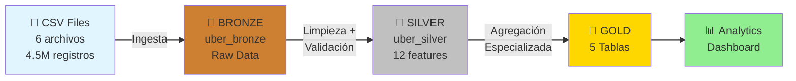

# 🚖 Uber NYC ETL Pipeline

<div align="center">


**Pipeline ETL profesional con Arquitectura Medallion para análisis de 4.5M+ viajes de Uber en NYC**

[Características](#-características-principales) • [Instalación](#-instalación) • [Uso](#-uso-del-pipeline) • [Arquitectura](#-arquitectura-medallion) • [Resultados](#-resultados)

</div>

---

## 📋 Descripción

Pipeline ETL End To End para el análisis de **4.5+ millones de viajes de Uber en Nueva York** (abril-septiembre 2014), implementando una arquitectura de lago de datos tipo **Medallion** con tres capas (Bronze, Silver, Gold). 

Este proyecto demuestra capacidades avanzadas de ingeniería de datos utilizando tecnologías cloud-native y mejores prácticas de la industria para transformar datos crudos en insights accionables de negocio.

### 🎯 Objetivos

**Objetivos de Negocio:**
- Analizar patrones de demanda temporal y geográfica de Uber NYC
- Identificar hotspots de alta concentración de viajes
- Optimizar operaciones mediante insights de horas pico y rendimiento por base
- Generar KPIs ejecutivos para toma de decisiones estratégicas

**Objetivos Técnicos:**
- Construir un pipeline ETL escalable y mantenible
- Implementar mejores prácticas de Data Engineering
- Demostrar experiencia con Databricks, PySpark y Delta Lake
- Crear un portafolio profesional de ingeniería de datos

---

## ✨ Características Principales

```
✅ Arquitectura Medallion completa (Bronze → Silver → Gold)
✅ Procesamiento distribuido con Apache Spark
✅ Transacciones ACID mediante Delta Lake
✅ Ingeniería de 12 características automatizadas
✅ Validaciones de Data Quality en cada capa
✅ 5 tablas Gold especializadas para analytics
✅ Dashboard ejecutivo con SQL analytics
✅ 100% reproducible en Databricks Free Edition
```

---

## 🛠️ Stack Tecnológico

### Lenguajes y Frameworks

| Categoría | Tecnologías |
|-----------|------------|
| **Procesamiento** |   |
| **Storage** |  |
| **Análisis** |   |
| **Testing** |  |

### Componentes Clave

```python
# Procesamiento de Datos
├── PySpark 3.x          # Motor de procesamiento distribuido
├── Delta Lake 2.x       # Transacciones ACID y versionado
├── Pandas 2.x           # Análisis de datos locales
│
# Visualización
├── Plotly 5.x           # Visualizaciones interactivas
├── Matplotlib 3.x       # Gráficos estáticos
├── Seaborn 0.12+        # Visualizaciones estadísticas
│
# Testing y Calidad
├── pytest 7.x           # Framework de testing
└── Great Expectations   # Data quality validations
```

### Plataforma

- **Databricks Free Edition** - Plataforma de procesamiento
- **Delta Lake** - Storage layer con ACID transactions
- **Apache Spark** - Motor de procesamiento distribuido
- **Jupyter Notebooks** - Desarrollo interactivo

---

## 📁 Estructura del Proyecto

```
uber-nyc-etl-pipeline/
│
├── 📓 notebooks/                          # Notebooks Databricks (núcleo del pipeline)
│   ├── 01_Bronze_Layer.ipynb             # Ingesta de 4.5M registros
│   ├── 02_Silver_Layer.ipynb             # Limpieza + 12 features
│   ├── 03_Gold_Layer.ipynb               # 5 tablas agregadas
│   └── 04_Dashboard_Analytics.ipynb      # SQL Analytics + Insights
│
├── 🐍 src/                                # Código Python modular
│   ├── pipeline/
│   │   ├── bronze_layer.py               # Funciones de ingesta
│   │   ├── silver_layer.py               # Transformaciones
│   │   └── gold_layer.py                 # Agregaciones
│   ├── utils/
│   │   ├── data_quality.py               # Validaciones
│   │   ├── transformations.py            # Transformaciones reutilizables
│   │   └── helpers.py                    # Funciones auxiliares
│   └── config/
│       └── settings.py                    # Configuraciones
│
├── 🧪 tests/                              # Suite de testing
│   ├── test_bronze_layer.py
│   ├── test_silver_layer.py
│   ├── test_gold_layer.py
│   └── test_data_quality.py
│
├── 📊 data/
│   ├── raw/                               # CSVs originales (6 archivos)
│   ├── sample/                            # Datos de muestra
│   └── processed/                         # Outputs locales
│
├── 📚 docs/                               # Documentación técnica
│   ├── architecture.md
│   ├── data_dictionary.md
│   ├── pipeline_workflow.md
│   └── images/
│
├── 📄 reports/
│   └── Report_Pipeline_Uber_2014.pdf     # Informe completo
│
└── 🔧 scripts/
    ├── setup_environment.sh
    ├── run_pipeline.py
    └── validate_data.py
```

---

## 🏗️ Arquitectura Medallion



### 🥉 Bronze Layer - Raw Data Ingestion

| Aspecto | Detalle |
|---------|---------|
| **Input** | 6 archivos CSV (Abril-Septiembre 2014) |
| **Proceso** | Ingesta sin modificaciones + metadatos de auditoría |
| **Output** | Tabla Delta `uber_bronze` (4,534,327 registros) |
| **Formato** | Delta Lake (ACID transactions) |

### 🥈 Silver Layer - Cleaned & Enriched

| Aspecto | Detalle |
|---------|---------|
| **Input** | Tabla `uber_bronze` |
| **Transformaciones** | Conversión de tipos, validación geográfica, eliminación de duplicados |
| **Feature Engineering** | Creación de 12 características temporales |
| **Output** | Tabla Delta `uber_silver` (4,502,417 registros) |
| **Tasa de Retención** | 99.3% (31,910 registros filtrados) |

**Features Creadas:**
- Características temporales: `year`, `month`, `day`, `hour`, `day_of_week`, `is_weekend`
- Categorización temporal: `time_of_day`, `hour_category`, `day_part`
- Métricas geográficas: `lat_rounded`, `lon_rounded`
- Identificadores: `trip_id`

### 🥇 Gold Layer - Business-Ready Analytics

| Tabla | Registros | Descripción |
|-------|-----------|-------------|
| `daily_metrics` | 183 | Agregaciones diarias |
| `base_hourly_metrics` | 120 | Performance por base/hora |
| `monthly_kpis` | 6 | Tendencias mensuales con MoM growth |
| `spatial_metrics` | 1,684 | Análisis geoespacial |
| `executive_dashboard` | 1 | KPIs globales |

---

## 🚀 Instalación

### Prerrequisitos

- Python 3.9 o superior
- Cuenta en [Databricks Free Edition](https://www.databricks.com/learn/free-edition) (gratuita)
- Git instalado

### Paso 1: Clonar el Repositorio

```bash
git clone https://github.com/MRiveraV24/Proyecto_04_uber-nyc-etl-pipeline.git
cd Proyecto_04_uber-nyc-etl-pipeline
```

### Paso 2: Configurar Entorno Virtual

```bash
# Crear entorno virtual
python -m venv venv

# Activar entorno virtual
# En Windows:
venv\Scripts\activate
# En macOS/Linux:
source venv/bin/activate
```

### Paso 3: Instalar Dependencias

```bash
pip install -r requirements.txt
```

### Paso 4: Configurar Databricks

1. Crear cuenta gratuita en [Databricks Free Edition](https://www.databricks.com/learn/free-edition/)
2. Crear un nuevo Workspace
3. Importar los notebooks desde la carpeta `notebooks/`
4. Subir los datos CSV a DBFS (Databricks File System)

### Paso 5: Configurar Rutas

Editar `src/config/settings.py` con tus rutas de Databricks:

```python
# Rutas de datos en DBFS
SOURCE_PATH = "/Volumes/workspace/default/uber_etl_azure/"
BRONZE_PATH = "/Volumes/workspace/default/uber_etl_azure/bronze/"
SILVER_PATH = "/Volumes/workspace/default/uber_etl_azure/silver/"
GOLD_PATH = "/Volumes/workspace/default/uber_etl_azure/gold/"
```

---

## 💻 Uso del Pipeline

### Opción 1: Ejecución en Databricks (Recomendado)

#### 🥉 Paso 1: Bronze Layer - Ingesta

```python
# Ejecutar: 01_Bronze_Layer.ipynb
# ✅ Ingesta 4.5M+ registros desde 6 archivos CSV
# ✅ Preserva estructura original sin modificaciones
# 📊 Output: Tabla Delta uber_bronze (formato ACID)
```

#### 🥈 Paso 2: Silver Layer - Transformación

```python
# Ejecutar: 02_Silver_Layer.ipynb
# ✅ Conversión de tipos de datos (timestamp, double)
# ✅ Validación geográfica (NYC bounds)
# ✅ Eliminación de duplicados (31,910 registros)
# ✅ Creación de 12 features temporales y geográficas
# 📊 Output: Tabla Delta uber_silver (4.5M registros limpios)
```

#### 🥇 Paso 3: Gold Layer - Agregación

```python
# Ejecutar: 03_Gold_Layer.ipynb
# ✅ Creación de 5 tablas especializadas:
#    • daily_metrics: Agregaciones diarias
#    • base_hourly_metrics: Performance por base/hora
#    • monthly_kpis: KPIs mensuales con MoM growth
#    • spatial_metrics: Análisis geoespacial (1,684 zonas)
#    • executive_dashboard: Resumen ejecutivo global
```

#### 📊 Paso 4: Dashboard y Analytics

```python
# Ejecutar: 04_Dashboard_Analytics.ipynb
# ✅ Análisis SQL interactivo
# ✅ Visualizaciones con Plotly
# ✅ Extracción de insights de negocio
```

### Opción 2: Ejecución Local (Testing)

```bash
# Ejecutar pipeline completo
python scripts/run_pipeline.py

# Validar calidad de datos
python scripts/validate_data.py

# Ejecutar tests
pytest tests/ -v
```

---

## 🧪 Testing

### Ejecutar Suite Completa

```bash
pytest tests/ -v --cov=src
```

### Tests por Capa

```bash
# Test Bronze Layer
pytest tests/test_bronze_layer.py -v

# Test Silver Layer
pytest tests/test_silver_layer.py -v

# Test Gold Layer
pytest tests/test_gold_layer.py -v

# Test Data Quality
pytest tests/test_data_quality.py -v
```

### Cobertura de Testing

```
✅ Validación de ingesta de datos
✅ Transformaciones de limpieza
✅ Ingeniería de características
✅ Agregaciones de negocio
✅ Calidad de datos end-to-end
```

---

## 📊 Resultados

### Métricas del Pipeline

| Métrica | Valor | Descripción |
|---------|-------|-------------|
| **Registros Procesados** | 4,502,417 | Viajes de Uber NYC (Abr-Sep 2014) |
| **Datos Brutos (Bronze)** | 4,534,327 | 100% de datos originales preservados |
| **Datos Curados (Silver)** | 4,502,417 | 99.3% de retención post-limpieza |
| **Tablas Gold** | 5 | Especializadas por caso de uso |
| **Features Creadas** | 12 | Temporales, geográficas y categóricas |
| **Zonas Geográficas** | 1,684 | Análisis espacial granular |
| **Crecimiento Período** | +81.5% | Abril → Septiembre 2014 |

### KPIs de Negocio

#### 📈 Rendimiento Operacional

```
Promedio de viajes diarios:   24,603 viajes/día
Bases activas:                 5 bases operacionales
Periodo de operación:          183 días continuos
Cobertura horaria:             24/7
```

#### ⏰ Análisis Temporal

```
Concentración rush hours:      42.5% de viajes
Actividad nocturna:            24.2% de viajes
Ratio Weekend/Weekday:         0.33
Mes más activo:                Septiembre (1,020,300 viajes)
```

#### 🗺️ Distribución Geográfica

```
Centro geográfico:             (40.7387°, -73.9742°)
Cobertura latitudinal:         0.3918°
Cobertura longitudinal:        0.5587°
Top Hotspot:                   Zona 40.75, -73.98 (222,857 viajes)
```

---

## 🔮 Próximas Mejoras

### 🔧 Mejoras Técnicas

- [ ] **Streaming de datos** con Structured Streaming de Spark
- [ ] **Particionamiento optimizado** por fecha y base_code
- [ ] **Z-Ordering** en Delta Lake para queries más rápidas
- [ ] **Data Quality Automation** con Great Expectations
- [ ] **CI/CD Pipeline** con GitHub Actions
- [ ] **Monitoring & Alerting** con Databricks SQL Analytics

### 📊 Mejoras de Análisis

- [ ] **Integración de datos climáticos** (correlación lluvia/demanda)
- [ ] **Análisis de eventos** (conciertos, deportes)
- [ ] **Modelos predictivos** (forecasting de demanda)
- [ ] **Detección de anomalías** con ML
- [ ] **Análisis de sentimiento** de redes sociales

### ☁️ Migración a Azure

- [ ] **Azure Data Factory** para orquestación
- [ ] **Azure Databricks** (producción)
- [ ] **Azure SQL Database** para capa Gold
- [ ] **Azure Key Vault** para secrets management
- [ ] **Azure DevOps** para CI/CD

---

## 📚 Documentación Adicional

- [Arquitectura Detallada](docs/architecture.md)
- [Diccionario de Datos](docs/data_dictionary.md)
- [Workflow del Pipeline](docs/pipeline_workflow.md)
- [Reporte Técnico Completo](reports/Report_Pipeline_Uber_2014.pdf)

---

## 📜 Licencia

Este proyecto está licenciado bajo la **MIT License** - ver el archivo [LICENSE](LICENSE) para más detalles.

---

## 👤 Autor

**Marcelo Rivera Vega**

[](https://tu-portfolio.com)
[](https://linkedin.com/in/marcelo-rivera-vega/)
[](https://github.com/MRiveraV24)
[](mailto:tu.marcelo.rivera.vega@gmail.com )

---

## 🙏 Agradecimientos

- **Databricks Free Edition** por proporcionar infraestructura gratuita
- **Kaggle** por el dataset de Uber NYC
- **Delta Lake** por su excelente documentación
- **Apache Spark Community** por el framework robusto
- Comunidad de **Data Engineering** en LinkedIn y Medium por inspiración y mejores prácticas

---

## 📖 Referencias

### Documentación Técnica
- [Delta Lake Documentation](https://docs.delta.io/)
- [Databricks Best Practices](https://docs.databricks.com/best-practices/index.html)
- [Apache Spark Guide](https://spark.apache.org/docs/latest/)
- [Medallion Architecture Pattern](https://www.databricks.com/glossary/medallion-architecture)

### Dataset
- [Uber Pickups in NYC - Kaggle](https://www.kaggle.com/fivethirtyeight/uber-pickups-in-new-york-city)

---

<div align="center">

### ⭐ Si este proyecto te resultó útil, considera darle una estrella en GitHub ⭐

[](https://github.com/tu-usuario/uber-nyc-etl-pipeline/stargazers)
[](https://github.com/tu-usuario/uber-nyc-etl-pipeline/network/members)

**[📝 Reportar Bug](https://github.com/tu-usuario/uber-nyc-etl-pipeline/issues)** • **[💡 Solicitar Feature](https://github.com/tu-usuario/uber-nyc-etl-pipeline/issues)** • **[🤝 Contribuir](CONTRIBUTING.md)**

---

*Última actualización: Octubre 2024*

</div>
